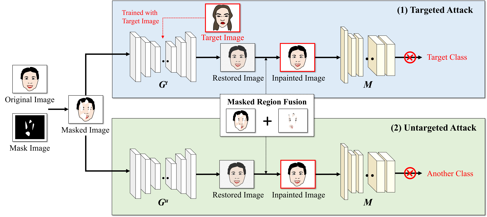
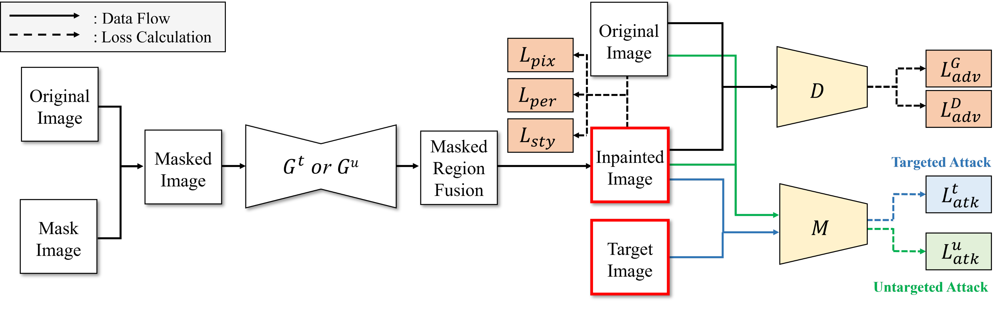
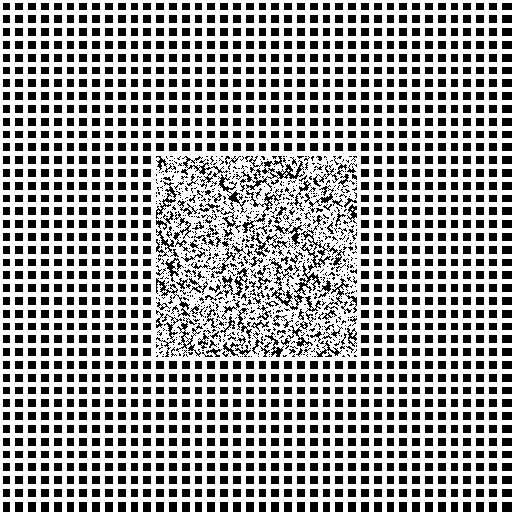

# AdverPaint: Inpainting-Based Adversarial Attack on Face Recognition Systems

Official implementation of **AdverPaint: Inpainting-Based Adversarial Attack on Face Recognition Systems**.

AdverPaint jointly performs image inpainting and adversarial perturbation injection to generate adversarial examples while preserving natural visual appearance.

<!-- The released code is intended for **inference and reproducibility of adversarial example generation** using the provided pretrained checkpoint. -->

<!--
Optional: place an overview figure at assets/overview.png and uncomment below.
-->
<p align="center">
  
</p>

<p align="center">
  
</p>


## Requirements

- Python 3.8 or newer
- PyTorch and torchvision (CUDA is recommended, but CPU inference is supported and slower)

Install the Python dependencies. Install the PyTorch build appropriate for the machine first if CUDA is needed; see [PyTorch's install selector](https://pytorch.org/get-started/locally/).

```bash
pip install -r requirements.txt
```

## 2. Download the pretrained checkpoint

Download `G0450000.pt` from:

**[Google Drive — checkpoint, mask, and example image](https://drive.google.com/drive/folders/1z4pT3xSWvsfmtiSl4D61rSos2EJIzu8C?usp=sharing)**

Place the checkpoint at:

```text
checkpoints/G0450000.pt
```

The Google Drive folder also contains `mask.png` and `example.jpg` for a quick test.

### 3. Prepare the files

A minimal directory layout is:

```text
AdverPaint/
├── checkpoints/
│   └── G0450000.pt
├── input/
│   └── example.jpg
├── inference.py
├── model.py
├── mask.png
├── requirements.txt
└── README.md
```

### 4. Run inference

```bash
python inference.py \
  --checkpoint checkpoints/G0450000.pt \
  --input-dir input \
  --mask mask.png \
  --output-dir output
```

Generated images are saved in `output/` using filenames of the form:

```text
<input-name>_inpainted.png
```

---

## Input Format

### Input images

Place source images in the `input/` directory.

Supported formats:

- `.jpg`
- `.jpeg`
- `.png`
- `.bmp`
- `.webp`

### Mask

Provide the binary mask as:

```text
mask.png
```

The inference script accepts a grayscale mask.

Images and masks are resized to **512 × 512** by default, and the generated output is therefore also **512 × 512**.

---

## Example

| Input | Mask |
|:---:|:---:|
|  |  |

---

## Notes

- This repository currently provides **inference code and a pretrained checkpoint**.
